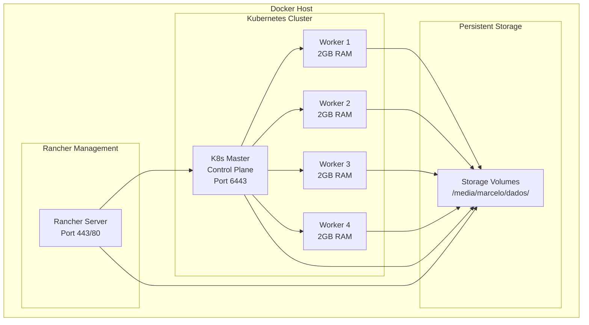

# 🏗️ Guia de Arquitetura e Componentes

## 📊 Visão Geral da Arquitetura

O ambiente simula um cluster Kubernetes de produção usando K3s (distribuição leve do Kubernetes) gerenciado pelo Rancher Server, tudo executando em containers Docker.

### 🔧 Componentes Principais



## 🎯 Detalhamento dos Componentes

### 1. Rancher Server
- **Imagem**: `rancher/rancher:latest`
- **Função**: Interface de gerenciamento web para Kubernetes
- **Portas**: 80 (HTTP), 443 (HTTPS)
- **Recursos**: Sem limite específico
- **Volume**: `/media/marcelo/dados/rancher-data`

#### Características:
- Interface web moderna para gerenciamento
- Suporte a múltiplos clusters
- RBAC integrado
- Monitoramento e alertas
- Catálogo de aplicações

### 2. Kubernetes Master (Control Plane)
- **Imagem**: `rancher/k3s:latest`
- **Função**: Nó de controle do cluster Kubernetes
- **Porta**: 6443 (Kubernetes API)
- **Recursos**: 2GB RAM
- **Volume**: `/media/marcelo/dados/k8s-master`

#### Componentes inclusos:
- **API Server**: Interface REST do Kubernetes
- **etcd**: Banco de dados distribuído
- **Controller Manager**: Controladores do cluster
- **Scheduler**: Agendador de pods
- **kubelet**: Agente local do Kubernetes
- **Container Runtime**: containerd

### 3. Workers (Nodes de Trabalho)
- **Quantidade**: 4 workers
- **Imagem**: `rancher/k3s:latest`
- **Função**: Executar workloads (pods)
- **Recursos**: 2GB RAM cada, 50GB storage
- **Volumes**: `/media/marcelo/dados/k8s-worker-[1-4]`

#### Componentes inclusos:
- **kubelet**: Agente local do Kubernetes
- **kube-proxy**: Proxy de rede
- **Container Runtime**: containerd
- **CNI**: Plugin de rede

## 🌐 Arquitetura de Rede

### Configuração de Rede Docker
```yaml
networks:
  k8s-network:
    driver: bridge
    ipam:
      config:
        - subnet: 172.20.0.0/16
```

### CIDRs Kubernetes
- **Cluster CIDR**: `10.42.0.0/16` (pods)
- **Service CIDR**: `10.43.0.0/16` (services)

### Comunicação entre Componentes
```
┌─────────────────┐    HTTPS/443     ┌─────────────────┐
│     Client      │ ──────────────→  │  Rancher Server │
│   (Browser)     │                  │   Management    │
└─────────────────┘                  └─────────────────┘
                                             │
                                             │ API Calls
                                             ▼
┌─────────────────┐    HTTPS/6443    ┌─────────────────┐
│     kubectl     │ ──────────────→  │   K8s Master    │
│   (CLI Tool)    │                  │  (Control Plane)│
└─────────────────┘                  └─────────────────┘
                                             │
                                    Internal Network
                                             │
                    ┌────────────────────────┼────────────────────────┐
                    │                        │                        │
            ┌───────▼───────┐      ┌────────▼────────┐      ┌────────▼────────┐
            │  K8s Worker 1  │      │  K8s Worker 2   │      │  K8s Worker 3/4 │
            │     Nodes      │      │     Nodes       │      │     Nodes       │
            └────────────────┘      └─────────────────┘      └─────────────────┘
```

## 💾 Arquitetura de Armazenamento

### Estrutura de Volumes
```
/media/marcelo/dados/
├── rancher-data/              # Dados do Rancher Server
│   ├── management-state/      # Estado do cluster
│   ├── cattle-global-data/    # Dados globais
│   └── server-url/            # Configurações de URL
├── rancher-audit/             # Logs de auditoria
├── k8s-master/                # Dados do Control Plane
│   ├── server/                # Dados do servidor K3s
│   ├── db/                    # etcd database
│   └── manifests/             # Manifests aplicados
├── k8s-worker-[1-4]/          # Dados dos Workers
│   ├── agent/                 # Dados do agente K3s
│   └── containerd/            # Runtime containers
├── k8s-config/                # Configurações kubectl
│   └── kubeconfig.yaml        # Arquivo de configuração
└── backups/                   # Backups automatizados
    ├── k8s_rancher_backup_*/  # Backups por timestamp
    └── safety_backup_*/       # Backups de segurança
```

### Tipos de Volumes
- **Bind Mounts**: Para dados persistentes
- **tmpfs**: Para dados temporários (`/run`, `/var/run`)
- **Named Volumes**: Para isolamento de dados

## 🔒 Arquitetura de Segurança

### Isolamento de Containers
- Cada container roda em namespace isolado
- Recursos limitados por container
- Rede segregada entre componentes

### RBAC (Role-Based Access Control)
```
┌─────────────────┐
│     Users       │
├─────────────────┤
│ • admin         │
│ • developers    │
│ • viewers       │
└─────────────────┘
         │
         ▼
┌─────────────────┐
│     Roles       │
├─────────────────┤
│ • cluster-admin │
│ • edit          │
│ • view          │
└─────────────────┘
         │
         ▼
┌─────────────────┐
│   Resources     │
├─────────────────┤
│ • pods          │
│ • services      │
│ • deployments   │
│ • etc...        │
└─────────────────┘
```

### Certificados TLS
- Rancher: Certificados auto-assinados
- Kubernetes: Certificados gerados pelo K3s
- Comunicação interna: TLS entre componentes

## 📈 Monitoramento e Observabilidade

### Métricas Disponíveis
- **Node Metrics**: CPU, RAM, Disk, Network
- **Pod Metrics**: Resource usage por container
- **Cluster Metrics**: API server performance

### Logs
- **Container Logs**: `docker compose logs`
- **Kubernetes Logs**: `kubectl logs`
- **System Logs**: journald integration

### Endpoints de Saúde
- Rancher: `https://localhost/ping`
- Kubernetes: `https://localhost:6443/healthz`

## 🚀 Escalabilidade

### Recursos por Componente
| Componente | CPU | RAM | Storage | Escalável |
|------------|-----|-----|---------|-----------|
| Rancher | ~0.5 core | ~1GB | ~5GB | Não |
| K8s Master | ~1 core | ~2GB | ~10GB | Não |
| K8s Worker | ~0.5 core | 2GB | 50GB | ✅ Sim |

### Adicionando Workers
Para adicionar mais workers, edite o `docker-compose.yml`:

```yaml
# Worker Node 5
k8s-worker-5:
  image: rancher/k3s:latest
  container_name: k8s-worker-5
  hostname: k8s-worker-5
  # ... configuração similar aos outros workers
```

## 🔧 Customização da Arquitetura

### Modificar Recursos
```yaml
# No docker-compose.yml
services:
  k8s-worker-1:
    mem_limit: 4g        # Aumentar RAM
    cpus: '2.0'          # Limitar CPU
    shm_size: 100g       # Aumentar shared memory
```

### Personalizar Rede
```yaml
networks:
  k8s-network:
    driver: bridge
    ipam:
      config:
        - subnet: 192.168.100.0/24  # Personalizar subnet
```

### Configurações K3s
```yaml
environment:
  - K3S_NODE_NAME=custom-worker
  - K3S_DISABLE=traefik,servicelb  # Desabilitar componentes
  - K3S_CLUSTER_INIT=true          # Cluster HA
```

---

📋 **Esta arquitetura foi projetada para ser flexível e facilmente customizável conforme suas necessidades de desenvolvimento e teste.**
